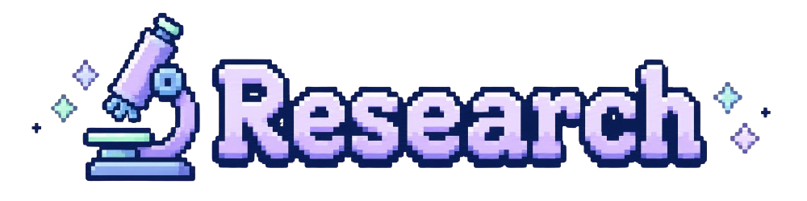

<div align="center">

[](https://student.redesigner.jp/portfolios/PF82b29f7d8c738912ce7e5edaad1b6103)


</div>

---

<p align="center">
  
</p>

```yaml
kyoung9:
  currently: "building small tools from tiny ideas"
  interests:
    - web apps
    - AI-powered tools
    - automation
    - security research
  research: entropy-based ransomware detection
  languages:
    - Korean
    - Japanese
    - English
```

---

<p align="center">
  
</p>

<div align="center">
  <table>
    <tr>
      <td></td>
      <td></td>
      <td></td>
      <td></td>
    </tr>
    <tr>
      <td></td>
      <td></td>
      <td></td>
      <td></td>
    </tr>
    <tr>
      <td colspan="4" align="center">
        
      </td>
    </tr>
  </table>
</div>

---

<p align="center">
  
</p>

<p align="center">
  <b>entropy-based ransomware detection</b> · evasion techniques
</p>

---

<p align="center">
  
</p>

<div align="center">
  <table>
    <tr>
      <td>
        
      </td>
      <td>
        
      </td>
    </tr>
  </table>
</div>

---

<p align="center">
  
</p>

<p align="center">
  <a href="mailto:gwakkyoungpin@gmail.com">
    
  </a>
  <a href="https://www.linkedin.com/in/kyoungpin-gwak-b953153a8">
    
  </a>
</p>

<!-- <p align="left">
  
</p> -->
