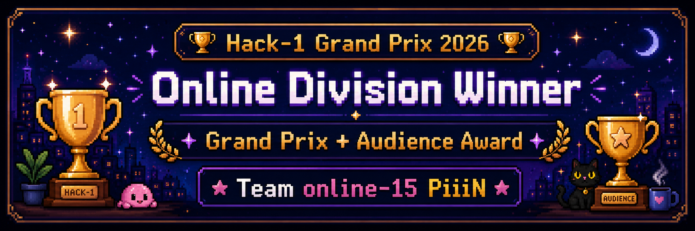
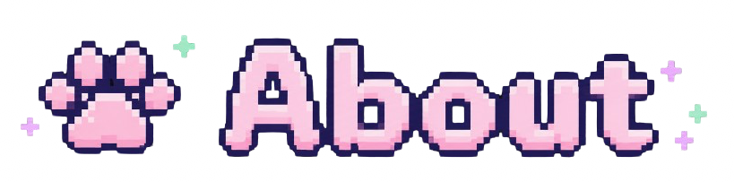
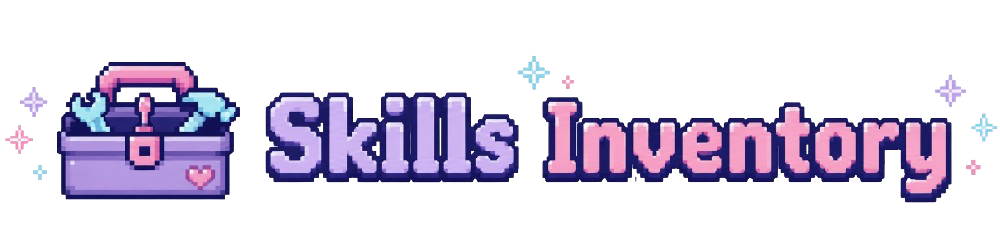
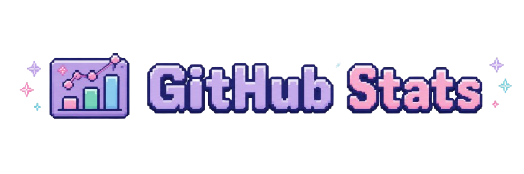
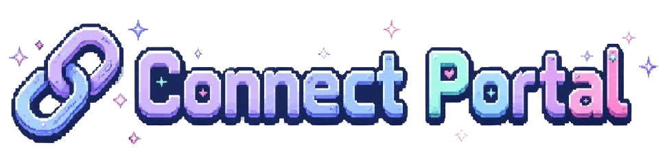

<div align="center">

[](https://developers.gmo.jp/cultures/interview/83991/)


# Kyoungpin Gwak

**Applied GenAI & Full-Stack Software Engineer**

Tokyo, Japan · M.Eng. candidate in Information Engineering (expected March 2027)

</div>

---

<p align="center">
  
</p>

```yaml
kyoungpin:
  current: "Software Engineer Intern building applied GenAI and full-stack cloud applications"
  focus:
    - specialized LLM agents and RAG
    - vision / OCR and evaluation
    - API automation and cloud delivery
  approach: "requirements discovery in Japanese → implementation → evaluation"
  languages:
    Korean: native
    Japanese: full professional proficiency
    English: conversational
```

---

<p align="center">
  
</p>

<div align="center">
  <table>
    <tr>
      <td align="center">
        
        
        
        
      </td>
    </tr>
    <tr>
      <td align="center">
        
        
        
        
        
        
      </td>
    </tr>
  </table>
</div>

---

<h2 align="center">🚀 Selected Public Work</h2>

| Project | What it demonstrates |
|---|---|
| [Whisky Exam Generator](https://github.com/Kyoung9/whisky-exam-generator) | AI-assisted practice-question generation, editing, and PDF export with Next.js and Supabase. |
| [WhiskyFinder-JP](https://github.com/Kyoung9/WhiskyFinder-JP) | Python web application for aggregating Japanese online prices with caching and CSV export. |
| [PiiiN Desktop](https://github.com/vyuma/posture-app) | Cross-device posture-habit product built by Team Nekoze-zu with Tauri, React, and TypeScript. |
| [PiiiN Mobile](https://github.com/vyuma/vibe-app) | React Native companion application for reminders and the mobile experience. |

<div align="center">

### 🏆 Hack-1 Grand Prix 2026

**Online Grand Prix & Audience Award** · Developer, Team Nekoze-zu

[](https://developers.gmo.jp/cultures/interview/83991/)
[](https://student.redesigner.jp/portfolios/PF82b29f7d8c738912ce7e5edaad1b6103)

</div>

---

<p align="center">
  
</p>

<div align="center">
  <table>
    <tr>
      <td>
        
      </td>
      <td>
        
      </td>
    </tr>
  </table>
</div>

---

<p align="center">
  
</p>

<p align="center">
  <a href="mailto:gwakkyoungpin@gmail.com">
    
  </a>
  <a href="https://www.linkedin.com/in/kyoungpin-gwak-b953153a8">
    
  </a>
</p>
